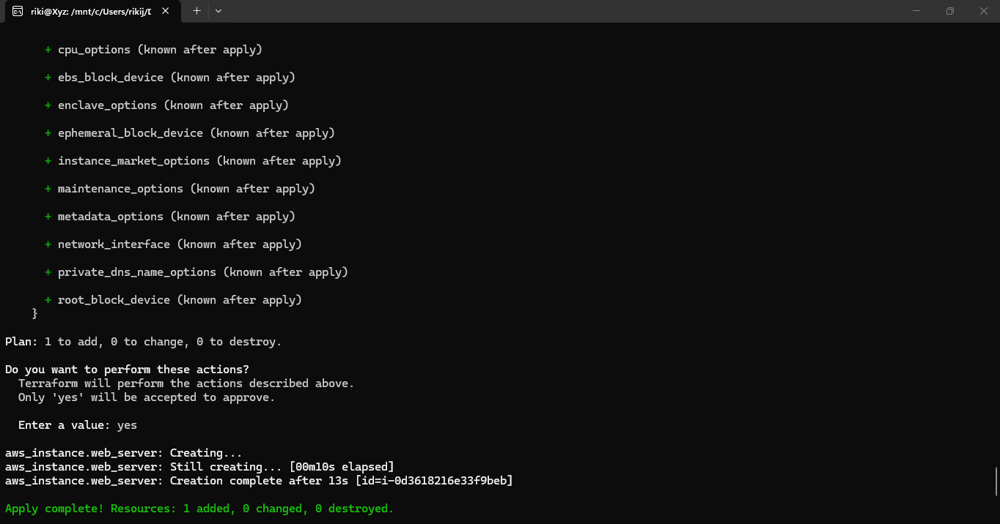

# Terraform AWS Web App Foundation

Repositori ini berisi kode *Infrastructure as Code* (IaC) menggunakan **Terraform** untuk membangun fondasi jaringan (*networking*) dan server virtual (*compute*) di cloud **Amazon Web Services (AWS)** region Singapura (`ap-southeast-1`).

---

## 🛠️ Komponen Infrastruktur yang Dibangun
Proyek ini secara otomatis memprovisikan sumber daya berikut menggunakan Terraform:
1. **Amazon VPC (Virtual Private Cloud)**: Jaringan privat terisolasi dengan blok CIDR `10.0.0.0/16`.
2. **Internet Gateway (IGW)**: Gerbang yang menghubungkan VPC ke internet publik.
3. **Public Subnet**: Subnet jaringan (`10.0.1.0/24`) yang berada di *Availability Zone* `ap-southeast-1a`.
4. **Amazon EC2 Instance**: Server virtual berbasis sistem operasi **Ubuntu 22.04 LTS** (`t2.micro` - Free Tier) yang ditempatkan di dalam subnet publik.

---

## 📸 Dokumentasi Hasil & Bukti Eksekusi

### 1. Eksekusi Terraform Berhasil


### 2. Tampilan Repositori di GitHub


---

## 📂 Struktur File Proyek
- `provider.tf` : Konfigurasi koneksi ke *provider* AWS dan penentuan region.
- `network.tf`  : Konfigurasi sumber daya jaringan (VPC, Internet Gateway, dan Subnet).
- `compute.tf`  : Konfigurasi pencarian AMI Ubuntu terbaru dan pembuatan server EC2.
- `.gitignore`  : Mengabaikan file sensitif dan file lokal milik Terraform (`.tfstate`, dll).

---

## 🚀 Cara Penggunaan (Deployment)

1. **Clone repositori ini:**
   ```bash
   git clone https://github.com/RikiJespo/terraform-aws-webapp.git
   cd terraform-aws-webapp
