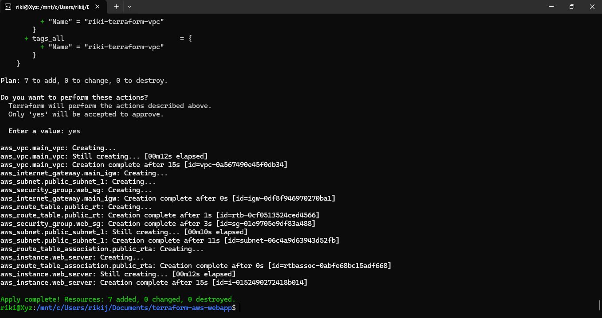
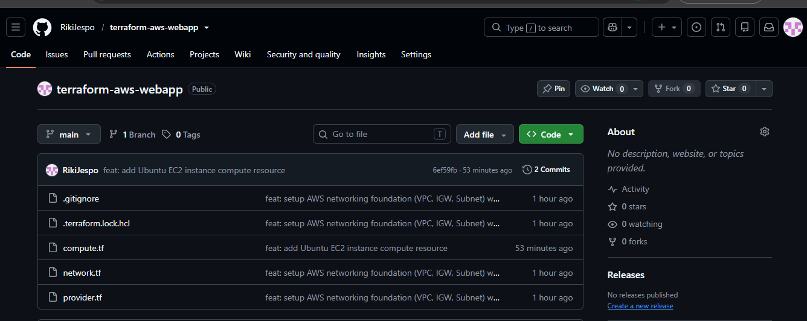

# Terraform AWS Web App Foundation

Repositori ini berisi kode *Infrastructure as Code* (IaC) menggunakan **Terraform** untuk membangun fondasi jaringan (*networking*) dan server virtual (*compute*) di cloud **Amazon Web Services (AWS)** region Singapura (`ap-southeast-1`).

---

## 🛠️ Komponen Infrastruktur yang Dibangun

Proyek ini secara otomatis memprovisikan sumber daya berikut menggunakan Terraform:

1. **Amazon VPC (Virtual Private Cloud)**: Jaringan privat terisolasi dengan blok CIDR `10.0.0.0/16`.
2. **Internet Gateway (IGW)**: Gerbang yang menghubungkan VPC ke internet publik.
3. **Public Subnet**: Subnet jaringan (`10.0.1.0/24`) yang berada di *Availability Zone* `ap-southeast-1a`.
4. **Route Table**: Menghubungkan subnet ke Internet Gateway, membuat subnet benar-benar bersifat publik.
5. **Security Group**: Mengizinkan inbound traffic SSH (port 22) dan HTTP (port 80).
6. **Amazon EC2 Instance**: Server virtual berbasis sistem operasi **Ubuntu 22.04 LTS** (`t2.micro` - Free Tier) yang ditempatkan di dalam subnet publik dan terhubung ke Security Group di atas.

---

## 📸 Dokumentasi Hasil & Bukti Eksekusi

### 1. Eksekusi Terraform Berhasil (7 resources: VPC, IGW, Subnet, Route Table, Route Table Association, Security Group, EC2)



### 2. Tampilan Repositori di GitHub



---

## 📂 Struktur File Proyek

- `provider.tf` : Konfigurasi koneksi ke *provider* AWS dan penentuan region.
- `network.tf`  : Konfigurasi sumber daya jaringan (VPC, Internet Gateway, Subnet, Route Table, Security Group).
- `compute.tf`  : Konfigurasi pencarian AMI Ubuntu terbaru dan pembuatan server EC2.
- `.gitignore`  : Mengabaikan file sensitif dan file lokal milik Terraform (`.tfstate`, dll).

---

## 🚀 Cara Penggunaan (Deployment)

1. **Clone repositori ini:**
```bash
   git clone https://github.com/RikiJespo/terraform-aws-webapp.git
   cd terraform-aws-webapp
   terraform init
   terraform plan
   terraform apply
```

2. **Hapus infrastruktur setelah selesai** (menghindari biaya berjalan):
```bash
   terraform destroy
```

---

## Challenges & Learnings

Pada percobaan pertama, konfigurasi hanya berhasil membuat EC2 instance tanpa Route Table dan Security Group yang eksplisit. Meskipun `terraform apply` berjalan sukses tanpa error, instance yang dihasilkan tidak benar-benar bisa diakses — subnet tidak terhubung ke internet karena tidak ada Route Table, dan traffic masuk diblokir karena memakai default Security Group AWS yang menolak semua inbound. Ini pelajaran penting: **"apply berhasil" tidak sama dengan "infrastruktur berfungsi penuh"**. Setelah menambahkan Route Table, Route Table Association, dan Security Group secara eksplisit, infrastruktur berhasil di-deploy ulang dengan 7 resource dan berfungsi sepenuhnya.
